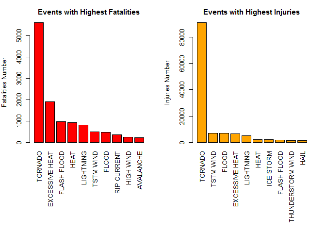

# Impacts of Severe Weather Evenets in USA
Mohamed A. Nour  
July 28, 2016  

## Introduction

Across the United States, tornadoes, excessive heat, and flash floods are most 
harmful with respect to population health.

Across the United States, tornadoes, thunderstorm winds, and flash floods have 
the greatest economic consequences.

Our raw data are taken from Natural Weather service portal as per the course project page.  The events in the database 
start in the year 1950 and end 
in November 2011.  Fatalities, injuries, and property damage (in dollars) are 
totalled over that time.  


## Data Processing


```r
setwd("C:/Users/Mohamed/Desktop/RepResearch")

storm <- read.csv("repdata-data-StormData.csv")
```


```r
event <- c("EVTYPE", "FATALITIES", "INJURIES", "PROPDMG", "PROPDMGEXP", "CROPDMG", 
           "CROPDMGEXP")

data <- storm[event]
```
__Finding property damage__

Property damage exponents for each level was listed out and assigned those values for the property exponent data. Invalid data was excluded by assigning the value as '0'. Then property damage value was calculated by multiplying the property damage and property exponent value.The code for this process was listed below


```r
unique(data$PROPDMGEXP)
```

```
##  [1] K M   B m + 0 5 6 ? 4 2 3 h 7 H - 1 8
## Levels:  - ? + 0 1 2 3 4 5 6 7 8 B h H K m M
```

__Assigning values for the property exponent data__
 
Replace the letters and  non numecic values with numbers for proper calculations


```r
data$PROPEXP[data$PROPDMGEXP == "K"] <- 1000

data$PROPEXP[data$PROPDMGEXP == "M"] <- 1e+06

data$PROPEXP[data$PROPDMGEXP == ""] <- 1

data$PROPEXP[data$PROPDMGEXP == "B"] <- 1e+09

data$PROPEXP[data$PROPDMGEXP == "m"] <- 1e+06

data$PROPEXP[data$PROPDMGEXP == "0"] <- 1

data$PROPEXP[data$PROPDMGEXP == "5"] <- 1e+05

data$PROPEXP[data$PROPDMGEXP == "6"] <- 1e+06

data$PROPEXP[data$PROPDMGEXP == "4"] <- 10000

data$PROPEXP[data$PROPDMGEXP == "2"] <- 100

data$PROPEXP[data$PROPDMGEXP == "3"] <- 1000

data$PROPEXP[data$PROPDMGEXP == "h"] <- 100

data$PROPEXP[data$PROPDMGEXP == "7"] <- 1e+07

data$PROPEXP[data$PROPDMGEXP == "H"] <- 100

data$PROPEXP[data$PROPDMGEXP == "1"] <- 10

data$PROPEXP[data$PROPDMGEXP == "8"] <- 1e+08
```
Replace invalid exponent data with '0' 


```r
data$PROPEXP[data$PROPDMGEXP == "+"] <- 0

data$PROPEXP[data$PROPDMGEXP == "-"] <- 0

data$PROPEXP[data$PROPDMGEXP == "?"] <- 0
```

Calculating the property damage value  


```r
data$PROPDMGVAL <- data$PROPDMG * data$PROPEXP
```

__Finding crop damage__

Crop damage exponents data is converted to numeric 


```r
# Exploring the crop exponent data  
unique(data$CROPDMGEXP)
```

```
## [1]   M K m B ? 0 k 2
## Levels:  ? 0 2 B k K m M
```

```r
## [1]   M K m B ? 0 k 2  
## Levels:  ? 0 2 B k K m M  
# Assigning values for the crop exponent data   

data$CROPEXP[data$CROPDMGEXP == "M"] <- 1e+06

data$CROPEXP[data$CROPDMGEXP == "K"] <- 1000

data$CROPEXP[data$CROPDMGEXP == "m"] <- 1e+06

data$CROPEXP[data$CROPDMGEXP == "B"] <- 1e+09

data$CROPEXP[data$CROPDMGEXP == "0"] <- 1

data$CROPEXP[data$CROPDMGEXP == "k"] <- 1000

data$CROPEXP[data$CROPDMGEXP == "2"] <- 100

data$CROPEXP[data$CROPDMGEXP == ""] <- 1

# Assigning '0' to invalid exponent data
data$CROPEXP[data$CROPDMGEXP == "?"] <- 0
# calculating the crop damage value
data$CROPDMGVAL <- data$CROPDMG * data$CROPEXP
```

Finding totals of each incident by event type.

" most harmful to population health" events are sorted based on their effect

" most harmful to econamic problem"" events are sorted based on their effect

For each incident (Fatalities,Injuries, Property damage and Crop damage) are calculated as follows:


```r
fatal <- aggregate(FATALITIES ~ EVTYPE, data, FUN = sum)
injury <- aggregate(INJURIES ~ EVTYPE, data, FUN = sum)
propdmg <- aggregate(PROPDMGVAL ~ EVTYPE, data, FUN = sum)
cropdmg <- aggregate(CROPDMGVAL ~ EVTYPE, data, FUN = sum)
```


## Plotting events with highest fatalities and highest injuries.


Highest fatalities and highest injuries are sorted as follows:

```r
# Listing  events with highest fatalities
fatal10 <- fatal[order(-fatal$FATALITIES), ][1:10, ]
# Listing events with highest injuries
injury10 <- injury[order(-injury$INJURIES), ][1:10, ]
par(mfrow = c(1, 2), mar = c(12, 4, 3, 2), mgp = c(3, 1, 0), cex = 0.8)
barplot(fatal10$FATALITIES, las = 3, names.arg = fatal10$EVTYPE, main = "Events with Highest Fatalities", 
        ylab = "Fatalities Number", col = "red")
barplot(injury10$INJURIES, las = 3, names.arg = injury10$EVTYPE, main = "Events with Highest Injuries", 
        ylab = "Injuries Number", col = "orange")
```

<!-- -->

## Plotting events with highest Property damage and highest crop damage.

Highest Property damage and highest crop damage are sorted as follows:


```r
# Finding events with highest property damage
propdmg10 <- propdmg[order(-propdmg$PROPDMGVAL), ][1:10, ]
# Finding events with highest crop damage
cropdmg10 <- cropdmg[order(-cropdmg$CROPDMGVAL), ][1:10, ]
par(mfrow = c(1, 2), mar = c(12, 4, 3, 2), mgp = c(3, 1, 0), cex = 0.8)
barplot(propdmg10$PROPDMGVAL/(10^9), las = 3, names.arg = propdmg10$EVTYPE, 
        main = "Events Causing Highest Property Damages", ylab = "Damage Cost ($ billions)", 
        col = "light blue")
barplot(cropdmg10$CROPDMGVAL/(10^9), las = 3, names.arg = cropdmg10$EVTYPE, 
        main = "Events Causing Highest Crop Damages", ylab = "Damage Cost ($ billions)", 
        col = "green")
```

<!-- -->

## Results and Conclusions


__Tornados__ caused the maximum number of fatalities and injuries. It was followed by Excessive Heat for fatalities and Thunderstorm wind for injuries.

__Floods__ caused the maximum property damage while __Drought__ caused the maximum crop damage. Second major events that caused the maximum damage was Hurricanes/Typhoos for property damage and Floods for crop damage.
